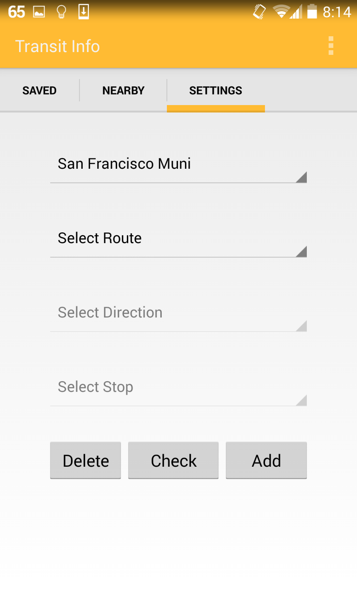

Transit App
===========

This is an android app that I made from scratch. It provides real-time GPS tracking based prediction of bus and metro arrival times for 60+ transit agencies. The core framework used to get real time data is the Nextbus API.

Screenshots
-----------

